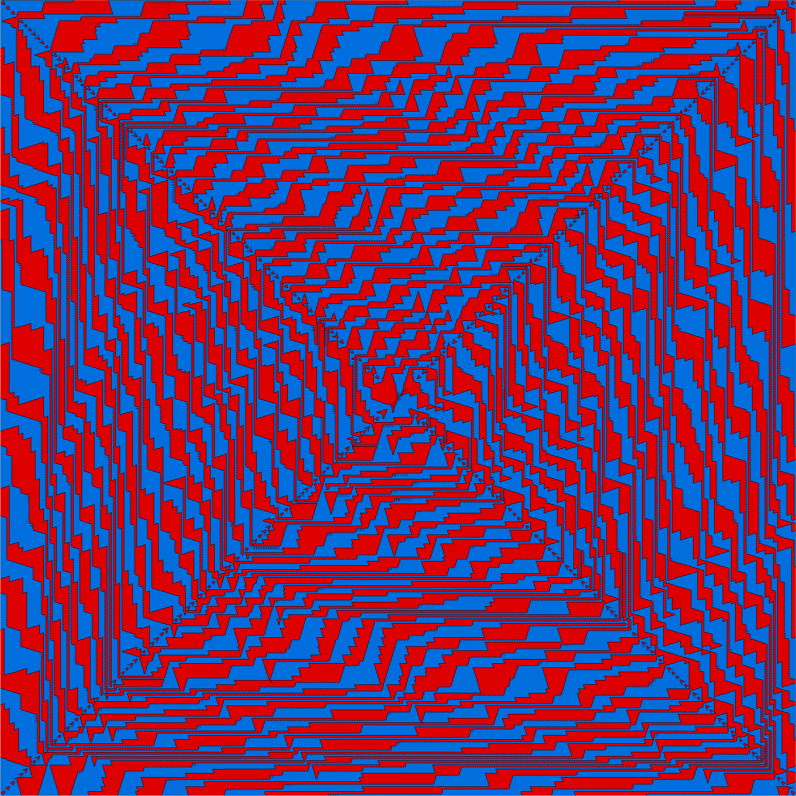

# Spiral Knights

Inspired by a video from [Numberphile](https://www.youtube.com/watch?v=UiX4CFIiegM)
on knights attacking each other on a spiral.

The C++ program creates a PNG of the resulting pattern. The program takes 3 optional arguments:

- The number of knights (defaults to 2)
- The side length of the spiral (defaults to 1000)
- The name of the PNG file (defaults to knights.png)
- The move set of the first piece (defaults to kn for knight)
- The move set of the second piece (defaults to kn for knight)
- etc

The available move sets are:
- kn: knight: jumps to 2 x 1 away
- zb: zebra: jumps to 3 x 2 away
- an: antelope: jumps to 4 x 3 away
- fe: ferz: jumps to 1 x 1 away
- al: alfil: jumps to 2 x 2 away
- wa: wazir: jumps to 0 x 1 away
- da: dabbaba: jumps to 0 x 2 away
- dr: dromedary: jumps to 0 x 3 away

The program is quite fast. On my lowly Intel i3770 from 2008, generating a spiral
of side 1000 is nearly instantaneous. One of size 10 000 takes a few seconds.

Here is an image showing the result of 4 knights in a 10 000 x 10 000 spiral:

Here is an image showing the result of a knight and a zebra in a 4 000 x 4 000 spiral:

